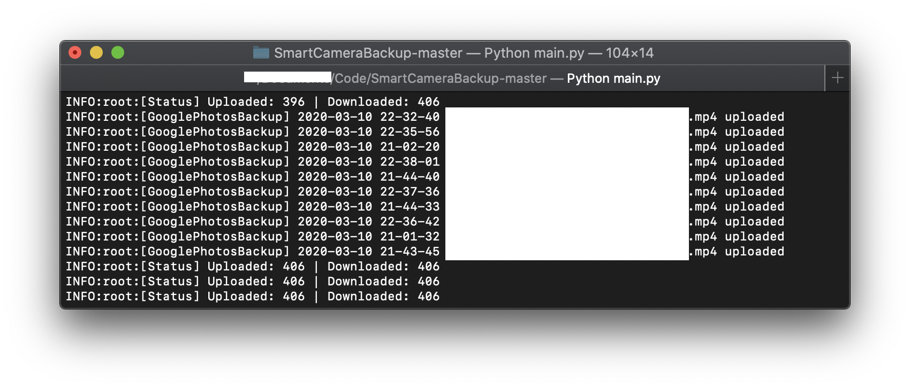

# Smart Camera Backup

Unlimited backup for your security camera footage! SCB downloads footage from your Arlo security camera and uploads them to Google Photos instantly, in real time!

## Features
* Looks for new footage in real time
* Asynchronous uploading/downloading of new video
* OAuth2 support with auto-refreshing tokens for Google

## Upcoming features
* Automatically clean video folder when uploads are done
* Integration with other security cameras (i.e. Nest)

### What you'll need
1. Google Cloud Platform Account
2. Python 3.7

## Installation

#### Step 1: Cloning
```
git clone https://github.com/mog3n/SmartCameraBackup
cd SmartCameraBackup
```
#### Step 2: Activating a virtual python environment
```
python3 -m venv $PWD/venv
source $PWD/venv/bin/activate

pip install -r requirements.txt
```
#### Step 3: Setting up your Google Photos API.
You'll need this to access your Google Photos account.

Go to: https://developers.google.com/photos/library/guides/get-started and click on "Enable the Google Photos API".
Follow the instructions to create a Google Cloud account and enable the Photos API.

You will be calling from a `web server` and using the redirect url `http://localhost:42069/auth`

At the end,
you'll be prompted with a `client id` and `client secret`.

Once you have everything setup, you'll want to write down the `client id` and `client secret`.

#### Step 4: Configurating the app
Under the file `credentials_example.py`, you'll want to fill in the `CLIENT_ID` and `CLIENT_SECRET` variables with the one you were given in Step 3.

Fill in your Arlo's account info: `ARLO_USERNAME` and `ARLO_PASSWORD`.

Then **rename** the file to credentials.py

#### Step 5: Starting Backup
```
python main.py
```
It should open your browser allowing you to sign in to your Google account. And that's it!
Let the script run 24/7 or have it open whenever you need a backup.
